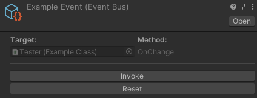
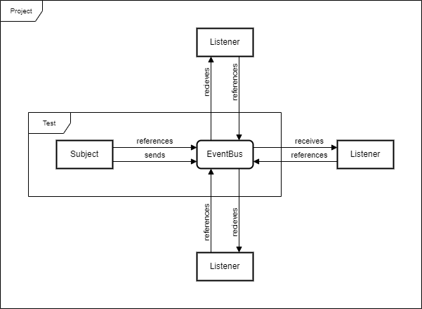

# [EventBus](../Runtime/EventBus.cs)

Class in `Incantium.Events` | Assembled in [`Incantium.ScriptableEvent`](../README.md)

Extends [`ScriptableObject`](https://docs.unity3d.com/ScriptReference/ScriptableObject.html)

## Description



The EventBus is a [ScriptableObject](https://docs.unity3d.com/6000.0/Documentation/Manual/class-scriptableobject.html)
that other scripts can subscribe to and listen to invocations from other scripts.

The main use case is to decouple code that needs to be developed and tested separately. In many circumstances, game
objects that are depended on other systems (through references) cannot be tested in isolation without their references
being set. The EventBus solves this problem by creating a common point to which the dependent system are coupled.



As seen in the image at the top, the EventBus 
[ScriptableObject](https://docs.unity3d.com/6000.0/Documentation/Manual/class-scriptableobject.html) has a build-in
custom inspector where every subscription is visible. It also has an Invoke button to invoke every subscriber from the 
inspector for testing purposes, alongside a Reset button to remove all subscriptions.

## Example

```csharp
using Incantium.Events;
using UnityEngine;

public class ExampleClass : MonoBehaviour
{
    [SerializeField]
    private EventBus<string> eventBus;

    // Subscribe to the event anywhere you want.
    private void Start() => eventBus.onReceive += Receive;

    // Don't forget to unsubscribe from the event at some point.
    private void OnDestroy() => eventBus.onReceive -= Receive;

    // Listen to the event.
    private void Receive(string message) => Debug.Log(message);
    
    // Invoke the event when needed.
    public void OnClick() => eventBus.Send("Hello World");
}
```

## Notes

> **Info**: This package includes basic event bus implementations for default/void, boolean, integer, float, double, 
> string, Vector2, Vector3, and GameObject.

## Variables

### :green_book: `UnityAction` onSend

Subscribe to this event to send and receive notifications.
